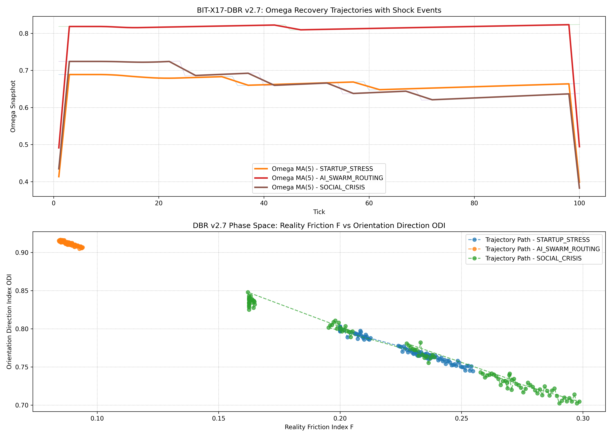
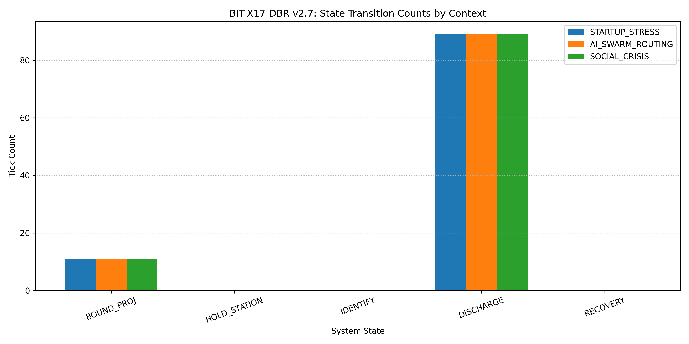
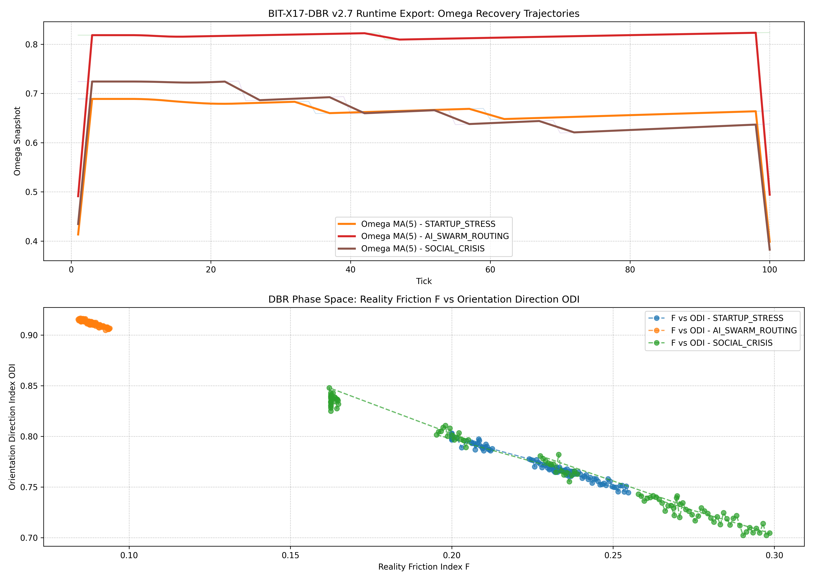
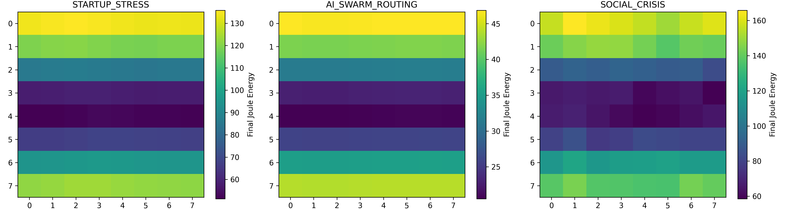

# BIT-X17-DBR

## Dynamic Boundary Relaxation Sandbox Engineering Framework

---

## Core Philosophy

> **"Khóa giao thức — Buông công thức cục bộ."**

BIT-X17-DBR is an adaptive boundary regulation sandbox framework designed to study how complex systems absorb disturbance, regulate boundary pressure, and recover toward stable operational corridors.

Instead of searching for one universal equation for all conditions, DBR keeps a fixed regulation protocol while allowing local parameters to adapt dynamically to context.

---

# System Definition

DBR (Dynamic Boundary Relaxation) is a telemetry-driven state-transition framework for:

* adaptive regulation,
* nonlinear dissipation,
* recovery trajectory analysis,
* and stability corridor benchmarking.

The framework explores how systems respond under different combinations of:

* direction coherence,
* friction pressure,
* and persistence capacity.

---

# Measurement Layer (0.0 → 1.0)

The framework standardizes three practical runtime indices:

| Index   | Definition                                                                                |
| ------- | ----------------------------------------------------------------------------------------- |
| **ODI** | Orientation Direction Index — measures trajectory stability and directional coherence     |
| **F**   | Reality Friction Index — measures external resistance, pressure, and operational friction |
| **MI**  | Meaning Index — measures persistence, engagement, and willingness to continue trajectory  |

All metrics are normalized into a unified scale:

```text
0.0 → 1.0
```

---

# Runtime State Protocol

DBR operates through a fixed six-stage regulation pipeline:

```text
INGESTION
→ BOUND_PROJ
→ HOLD_STATION
→ IDENTIFY
→ DISCHARGE
→ RECOVERY
```

The protocol remains fixed.

Local diffusion, leakage, and recovery dynamics are context-adaptive.

---

# Benchmark Contexts

## STARTUP_STRESS

High-friction operational environment with strong persistence pressure.

Characteristics:

* elevated boundary load,
* slower recovery,
* stronger dissipation retention.

---

## AI_SWARM_ROUTING

Low-friction adaptive routing environment.

Characteristics:

* high coherence,
* rapid diffusion,
* fast stabilization.

---

## SOCIAL_CRISIS

Chaotic and unstable social runtime environment.

Characteristics:

* directional fragmentation,
* unstable persistence,
* prolonged identification phase.

---

# Repository Structure

```text
BIT-X17-DBR/
├── README.md
├── python/
│   └── bit_x17_dbr_benchmark_v27.py
├── csv/
│   └── .gitkeep
├── plots/
│   ├── dbr_v27_trajectory_benchmark_map.png
│   ├── dbr_v27_state_transition_counts.png
│   └── dbr_v27_final_energy_heatmaps.png
└── notes/
    └── measurement_layer.md
```

---

# Quick Start

Run the benchmark engine:

```bash
python python/bit_x17_dbr_benchmark_v27.py
```

---

# Outputs

The framework automatically generates:

* telemetry CSV logs,
* trajectory benchmark plots,
* phase-space comparison maps,
* state transition statistics,
* final energy heatmaps.

---

# Benchmark Visualizations

## Trajectory Benchmark



---

## State Transition Counts



---

## Final Energy Heatmaps


---

# Engineering Position

This repository is an exploratory sandbox engineering framework for adaptive system regulation experiments.

The simulations are intended for:

* telemetry benchmarking,
* trajectory comparison,
* recovery analysis,
* and adaptive runtime experimentation.

Numerical outputs are illustrative runtime snapshots generated under local assumptions and simulation conditions.

They are not universal physical constants.

---

# Long-Term Direction

DBR currently acts as:

* a regulation layer,
* a recovery telemetry layer,
* and a boundary adaptation sandbox

inside the broader BIT-X runtime architecture.

Potential future expansion may include:

* distributed governance runtime,
* swarm coordination regulation,
* human cognitive persistence modeling,
* adaptive infrastructure control,
* and multi-agent recovery systems.
  ## Benchmark Visualizations
  ---

# Runtime Benchmark Outputs

## Trajectory Recovery Map



---

## State Transition Counts


---

## Final Energy Heatmaps



### Trajectory Benchmark


### State Transition Counts


### Final Energy Heatmaps


---

# Author

Bùi Quang Trịnh
Independent Researcher
Founder of Boundary Information Theory (BIT)

Vietnam

---
