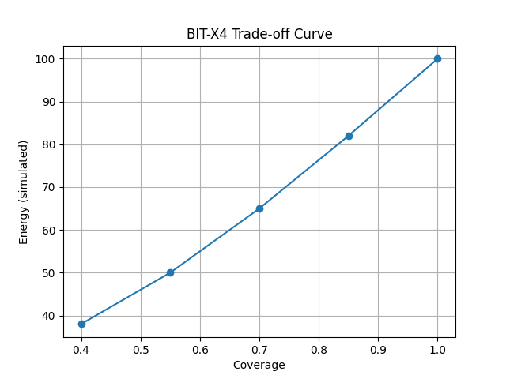

# BIT-X Runtime Proof

**Boundary-aware selective computation, audit, and system diagnosis based on Boundary Information Theory.**

Author: Bùi Quang Trịnh (Vietnam)  
Framework: Boundary Information Theory (BIT)

---

## Overview

Modern systems compute, transfer, and react too much by default.

BIT-X explores a different principle:

> Not all information deserves equal computation.

Instead of optimizing only hardware, BIT-X studies how systems can reduce waste by identifying boundaries, coherence, friction, and instability before execution.

---

## BIT-X Structure

### BIT-X1 — Boundary Logic

The conceptual layer: life, systems, relationships, and stability through boundaries.

### BIT-X2 — Compute Audit

The operational layer: GPU efficiency, Tokens/Joule, heat, boundary friction, and audit tools.

### BIT-X3 — System Diagnosis

The diagnostic layer: root cause analysis, boundary diagnosis, phase collapse, and stability envelopes.

### BIT-X4 — Runtime Proof

The execution layer: boundary-aware selective computation and input coherence gating.

---

## Core Principle

> Compute only when the boundary condition justifies computation.

---

## Repository Map
---

## 📊 Preliminary Result (Simulation)



The trade-off curve shows:

- Lower coverage → lower compute cost  
- Slight accuracy reduction → improved efficiency  

This suggests that boundary-aware selection can reduce unnecessary computation under controlled conditions.

---

## 🔍 Interpretation

This is an early simulation result.

- The system processes less data (reduced coverage)  
- Energy usage decreases accordingly  
- Accuracy degrades gradually, not catastrophically  

This indicates a **controlled trade-off between efficiency and performance**.

---

## ⚠️ Status

- Simulation-based result  
- Not a physical energy measurement yet  
- NVIDIA GPU validation is in progress  

---

> Even in simulation, boundary-aware selection shows a consistent trade-off between compute cost and output quality.
```text
Create main README
docs/
x1_boundary_logic/
x2_compute_audit/
x3_system_diagnosis/
x4_runtime_proof/
assets/
