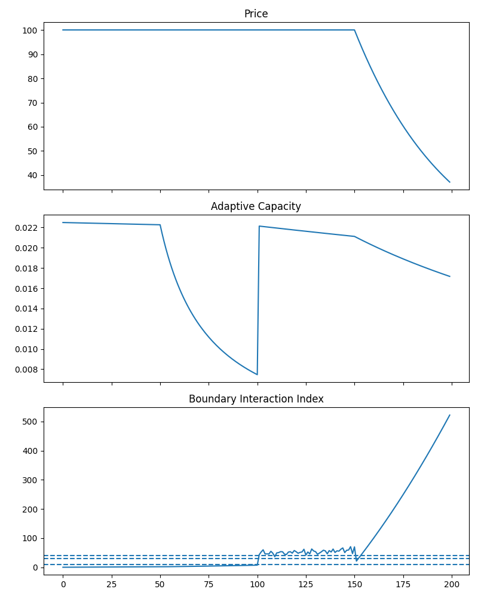

# 🚀 BIT-X6.2 — Boundary-Based Instability Diagnostics

Boundary-aware diagnostic framework for detecting instability in time-series systems.

---

## 🧠 Core Idea

Traditional systems react to price.

BIT-X6.2 monitors **structural imbalance**:

- Boundary Interaction Index (Ξ)
- Effective Adaptive Capacity (α_eff)

Instability is defined as:

> Pressure accumulation / Reduced adaptive capacity

---

## ⚙️ What this repo does

- Detects instability before price collapse
- Generates decision states:
  - ALLOW
  - REDUCE
  - RESTRICT
  - FREEZE
- Evaluates impact on equity curve

---

## 📊 Example Output



---

## 📈 Key Observation

- Ξ increases **before** price drop
- Decision layer reduces exposure
- Drawdown reduced vs baseline

---

## ▶️ How to run

```bash
python demo.py
